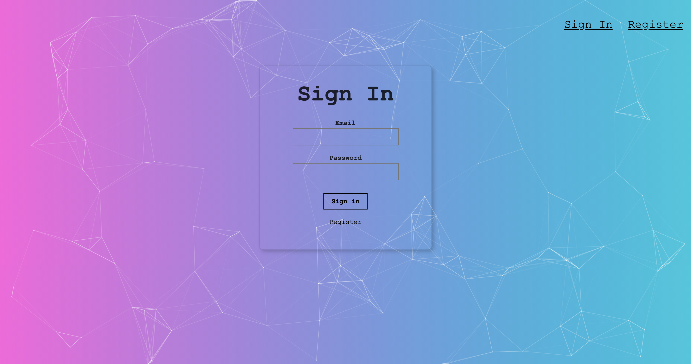
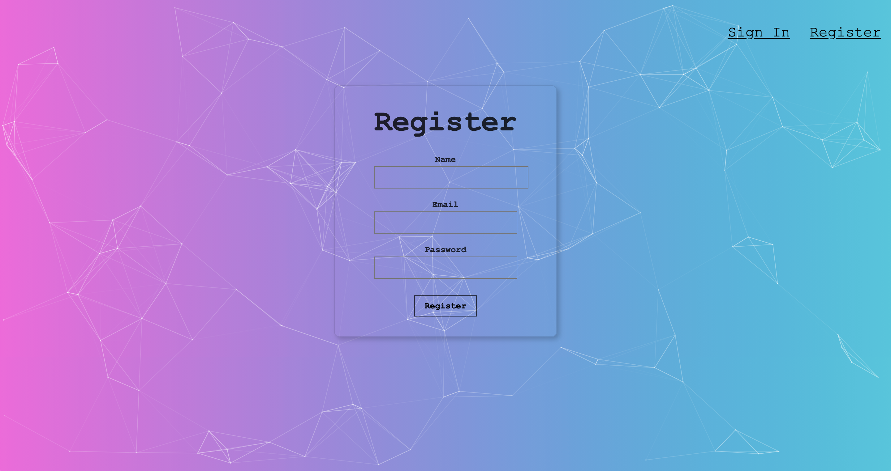
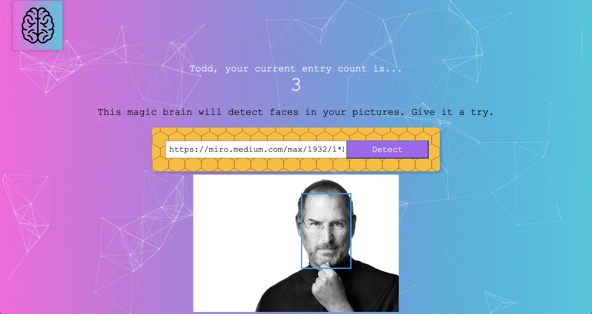

# About

This is a full stack project which is a facial recognition application. By addinig a image url with a face, the app with detect the face within the image and cast a square arount the face location. It will track the user's number of entries and display them real time on the screen. 

# Technologies

The technologies used to build this website include:

- HTML5
- CSS3
- REACT
- NODE.JS
- EXPRESS.JS
- POSTGRESQL

# More info

This website includes 3 main pages:

1. Signin
2. Register
3. Profile

### Signin

The signin page of the app allows you to signin if you are already a registered user. 

Use dummy credentials to try out the app: 

username: todd@gmail.com
password: 123

### Register

The register page allows you to register as a user in order to login to the app and keep track of your entries. Enter a email address and a password of your choice to use the app. 

### Profile

The profile page features the amount of entries you have put into the app and a section to put in an image url for facial recognition. Your user information and entries count are stored in the backend through PostgreSQL and the backend server side is handled through express.js. The facial recognition is handled through the 
Clarifai API (https://docs.clarifai.com/).

# Website Images

Signin:

Regiser:

Profile:

